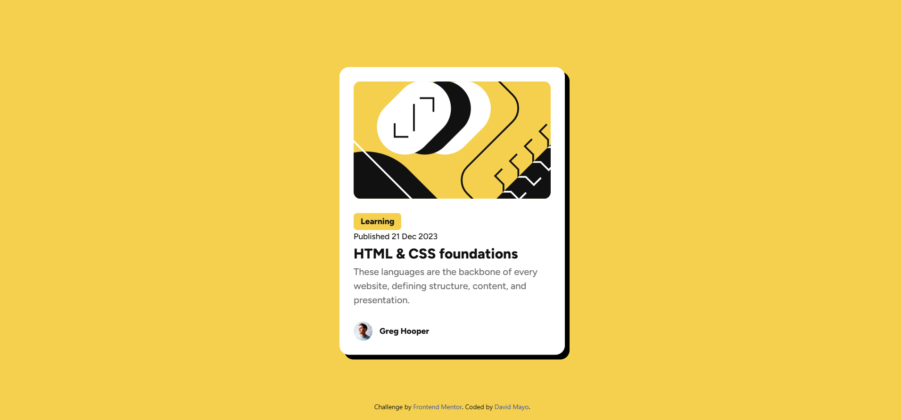

# Frontend Mentor - Blog preview card solution

This is a solution to the [Blog preview card challenge on Frontend Mentor](https://www.frontendmentor.io/challenges/blog-preview-card-ckPaj01IcS). Frontend Mentor challenges help you improve your coding skills by building realistic projects. 

## Table of contents

- [Overview](#overview)
  - [The challenge](#the-challenge)
  - [Screenshot](#screenshot)
  - [Links](#links)
- [My process](#my-process)
  - [Built with](#built-with)
  - [What I learned](#what-i-learned)
  - [Continued development](#continued-development)
- [Author](#author)


**Note: Delete this note and update the table of contents based on what sections you keep.**

## Overview

### The challenge

Users should be able to:

- See hover and focus states for all interactive elements on the page
- Responsive for mobile devices

### Screenshot



### Links

- Solution URL: [Github repository](https://github.com/damayor/fm-blog-preview-card)
- Live Site URL: [Guthub Pages](https://damayor.github.io/fm-blog-preview-card/)

## My process

### Built with

- Semantic HTML5 markup
- CSS custom properties
- Flexbox
- Desktop-first workflow
- [TailwindCSS](https://tailwindcss.com/) - For styles

### What I learned

I went through the main principles of CSS in a flex area and also to become responsive. 
Use this section to recap over some of your major learnings while working through this project. Writing these out and providing code samples of areas you want to highlight is a great way to reinforce your own knowledge.

To see how you can add code snippets, see below:

```html
<h1>Some HTML code I'm proud of</h1>
```
```css
.blog-card-content {
  padding: var(--sp-300) 0;
  display: flex;
  flex: 1 0 auto;
  flex-direction: column;
  justify-content: space-between;
  color: var(--cl-gray-950);
}
```

### Continued development

- Start to using more Tailwind rules in a flexbox or grid context. 
- Responsive development not based on screen size.

## Author

- Website - [David Mayo](https://davidmayorgah.wixsite.com/visualcv?lang=en)
- Frontend Mentor - [@yourusername](https://www.frontendmentor.io/profile/damayor)
- Twitter - [@yourusername](https://www.twitter.com/damayor11)

